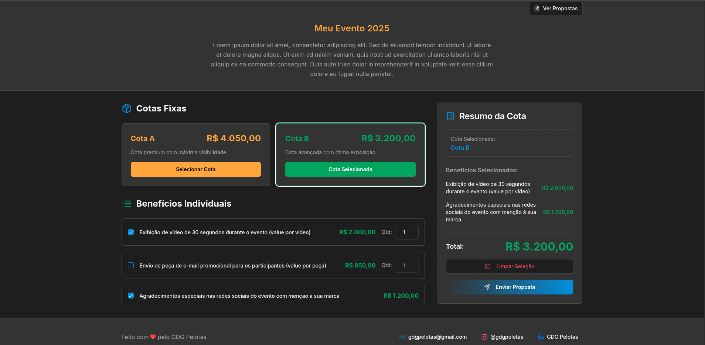
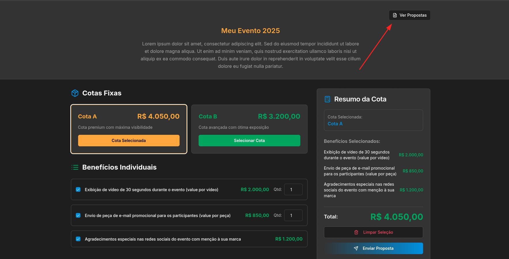

## 💰 Montador de Patrocinio

Esta é uma aplicação para auxiliar empresas que desejam patrocinar eventos de tecnologia possam avaliar os benefícios oferecidos em diferentes cotas de patrocínio e selecionar cotas pré-definidas ou personalizar a sua cota de patrocínio de acordo com a sua necessidade.

Ao entrar na aplicação, o possível patrocinador se depara com um formulário onde pode selecionar uma das cotas pré-definidas ou criar uma cota personalizada selecionando os benefícios da lista. Após ter selecionado os benefícios que deseja, o possível patrocinador pode clicar no botão de **Enviar Proposta** para enviar sua proposta de patrocínio à equipe organizadora do evento, e depois desse envio basta esperar o contato da equipe organizadora.

### 🤔 Como utilizar essa aplicação

Essa aplicação foi pensada para ser utilizada para auxiliar nos eventos do GDG Pelotas e para ser configurável facilmente para diferentes eventos. Por isso, para utilizar a aplicação primeiro temos o processo de execução inicial onde a aplicação funcionará com dados de exemplo e depois a configuração específica para o evento.

#### 🔧 Como rodar a aplicação

Para executar a aplicação, será preciso criar um projeto no Console do Firebase com o banco de dados Firestore configurado. Esse banco será necessário para armazenar as informações das cotas de patrocínio propostas.

Uma vez que você tenha configurado o Firebase, será necessáiro criar um arquivo `.env` no início da pasta raiz seguindo os moldes do arquivo `.env.sample` que se encontra na mesma pasta e preencher as variáveis de ambiente definidas nesse arquivo com os valores correspondentes das variáveis de acesso à sua aplicação no Firebase. São elas:

- `VITE_FIREBASE_API_KEY`: Chave da API do seu projeto Firebase.
- `VITE_FIREBASE_AUTH_DOMAIN`: Domínio de autenticação do seu projeto Firebase.
- `VITE_FIREBASE_PROJECT_ID`: ID do projeto no Firebase.
- `VITE_FIREBASE_STORAGE_BUCKET`: Bucket de armazenamento do Firebase.
- `VITE_FIREBASE_MESSAGING_SENDER_ID`: ID do remetente para mensagens do Firebase.
- `VITE_FIREBASE_APP_ID`: ID do aplicativo Firebase.
- `PORT`: Porta onde a sua aplicação deve rodar. Usa-se a porta 5000 por padrão.
- `VITE_ADMIN`: Indica se a sua aplicação será vista no modo administrador ou não. O valor padrão dela é `true`.

Uma vez que isso tenha sido feito, será necessário instalar as dependências da aplicação com o comando `npm i` e pronto, a aplicação já poderá ser acessada através da porta que você especificou. Os dados de teste já estarão disponíveis e a aplicação já está funcional nesse momento.

> **Importante:** No modo admin a aplicação conta com as funcionalidades para solicitar uma cota de patrocínio e para **visualizar as cotas submetidas**. A funcionalidade de solicitar uma cota fica disponível através da página inicial e para visualizar as submissões você pode clicar no botão **Ver Propostas** que aparece na tela inicial.
> 
> Ao colocar a aplicação em produção, você deve **setar a variável de ambiente `VITE_ADMIN` para `false` para que as funcionalidades de visualizar propostas sejam removidas da aplicação!**

#### 📑 Adicionando Dados

Para adicionar os dados referentes aos benefícios e às cotas de patrocínio do seu evento, será necessário editar os conteúdos da pasta `client/src/dados`. Os arquivos dessa pasta já contêm dados de teste que podem ser utilizados como modelos. Abaixo seguem instruções detalhadas para cada arquivo:

##### BenefitList

Neste arquivo você deve listar os benefícios das diferentes cotas de patrocínio. Cada um desses benefícios deve ser descrito como um objeto TypeScript com as seguintes propriedades:

- **id**: Texto utilizado para identificar esse benefício durante a execução da aplicação
- **name**: Nome do benefício. Essa informação será exibida na tela
- **description**: Descrição detalhada do benefício
- **value**: Valor unitário do benefício
- **quantity**: Quantidade de unidades daquele benefício (opcional, valor padrão: 1). Se não for possível aumentar a quantidade de elementos para o benefício, este campo pode ser ignorado.
- **maxQuantity**: Quantidade máxima de itens que o patrocinador pode solicitar daquele benefício (opcional, valor padrão: 1). Se não for possível aumentar a quantidade de elementos para o benefício, este campo pode ser ignorado.

Depois de preencher todos os benefícios disponíveis para o evento, será necessário exportar cada um deles individualmente e adicioná-los ao array `BenefitList` que se encontra no final do arquivo, conforme demonstrado nos dados de exemplo.

##### QuotaList

Neste arquivo serão descritas as cotas de patrocínio do evento. Aqui devem ser importados todos os benefícios definidos em BenefitList através de imports nomeados, pois esses benefícios serão utilizados para criar as cotas.

Dentro desse arquivo, você deve criar as cotas instanciando um novo objeto `Quota` que recebe os seguintes parâmetros:

- **id**: Texto utilizado para identificar a cota durante a execução da aplicação
- **name**: Nome da cota. Essa informação será exibida na tela
- **description**: Descrição da cota
- **benefits**: Um array contendo os benefícios selecionados para essa cota

Depois de definir todas as cotas necessárias para a sua aplicação, adicione-as ao array `QuotaList` no fim do arquivo.

> **Importante**: No arquivo é definida uma cota personalizada sem benefícios. Essa cota não deve ser removida, pois faz parte da lógica referente à criação personalizada de cotas.

##### EventDescription

Aqui temos um objeto onde devem ser preenchidos o nome e a descrição do evento. Essas informações serão utilizadas na interface para contextualizar os usuários sobre o evento para o qual estão considerando patrocínio.

### 🔴 Informações Relevantes

- Este projeto foi desenvolvido com a ajuda de [Replit](https://replit.com/)
